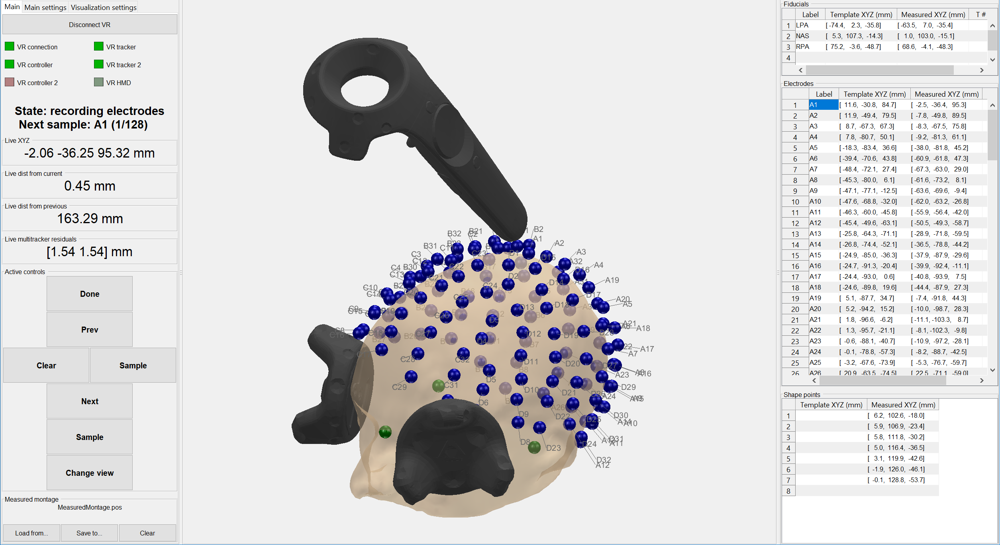

# VRDigitizer

VRDigitizer allows the use of consumer virtual reality systems (currently tested primarily with the HTC Vive) for digitization of EEG electrode positions.

## Installation

### Requirements

*Note: VRDigitizer has only been tested on Windows. Most features should work on MacOS/Linux but some tweaking of code will be required.*

*Note: VRDigitizer has been primarily evaluated with the HTC Vive. While other VR systems may function, their accuracy may be different than reported with the Vive, button mappings may not work completely, and rendered models in the GUI will be inaccurate. The instructions below assume the Vive is being used.*

Install SteamVR and set up your virtual reality system per the manufacturer's instructions.

### Option 1: compiled standalone app
Note: this option does **not** require a MATLAB license.
* Download latest release of `VRDigitizer_Installer.exe`
* Run the VRDigitizer installer. If you don't already have the free MATLAB runtime installed, the installer will download it automatically.
* To run VRDigitizer, open the installed `VRDigitizer.exe` (e.g. from the Start menu).

### Option 2: packaged MATLAB app
Note: this requires a MATLAB license. It has been tested with MATLAB R2017a; some older versions of MATLAB will not work.
* Download latest release of `VRDigitizer.mlappinstall`.
* Open the `.mlappinstall` file in MATLAB. You will be prompted to confirm whether to install the app.
* To run VRDigitizer, open the installed `VRDigitizer` app from the "Apps" toolstrip in MATLAB.

### Option 3: source
* Clone repo from Github.
* Download/install dependencies:
  * Python and pip
  * Open command prompt in `VRDigitizer/python` and run `pip install -r requirements.txt` to install `pyopenvr` and `cx_Freeze`.
* Build python helper, or set up to run `VRDigitizer_helper.py` manually.
  * Open command prompt in `VRDigitizer/python` and run `python setup.py build`. This will build  `VRDigitizer_helper` as an `.exe` (assuming you're using Windows).
* To run VRDigitizer, run `VRDigitizerGUI.m` in MATLAB.

## Usage

### Typical first-time setup
* Load a template montage. This should at minimum specify your intended fiducial locations, and can also include EEG electrode names and template positions for an arbitrary montage.
* Calibrate pointer (under Main settings->Calibrate pointer). Once calibrated, the saved calibration will auto-load in the future.
* Under Main Settings, choose which devices to use as head trackers (if any).
* Under Visualization Settings, choose which devices to render. If running on a low-performance computer, you may want to adjust the live redraw period to render less frequently, or disable live rendering of tracked devices entirely.

### Typical usage
1. Place head-tracking device(s) on subject (if using). Make sure each head tracker is oriented such that it is receiving tracking signals from both Lighthouses, and that it is stable on the subject's head.
2. Record fiducial locations (e.g. nasion and left/right preauricular points). These will be used to transform from the VR space to the local head space. This will also calibrate the relative positions of head trackers, if using multiple.
3. Record electrode locations.
4. Record head shape points. You may want to re-record fiducial locations as shape points here to quantify whether the head trackers shifted during measurement.
5. Save measured montage.
